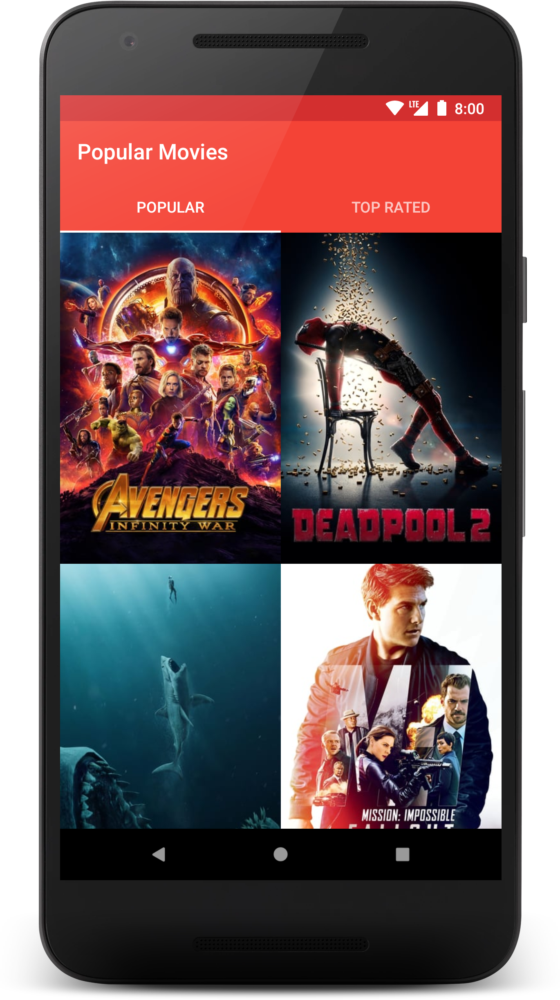
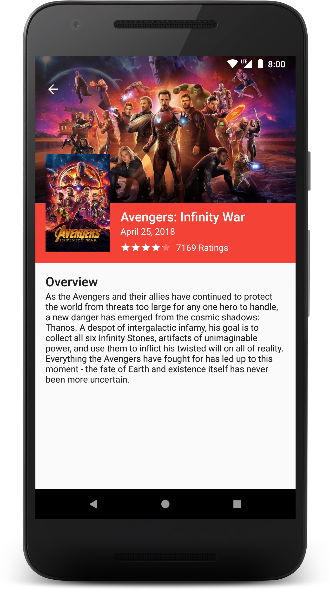
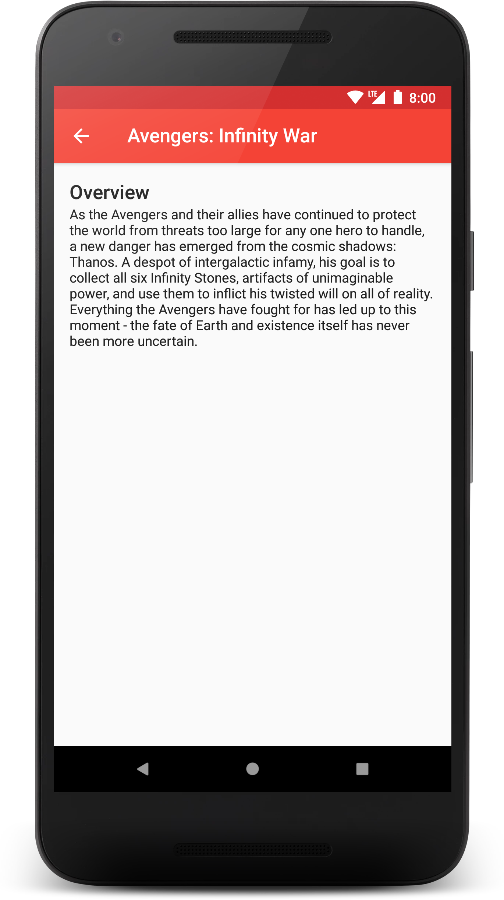

# Popular Movies

### Goals
* Pull data from a REST API and display that information.
* Save data locally using SQLite.
* Implement search using [SearchView](https://developer.android.com/reference/android/widget/SearchView).

### Non-Goals
* Optimize for landscape or tablet.
* [RecyclerView](https://developer.android.com/reference/android/support/v7/widget/RecyclerView) endless scrolling.

### Prerequisites

You will need to obtain an API key from [TMDb](https://www.themoviedb.org).  Once you have your API key add it to the [grade.properties](gradle.properties) file on the following line:

    TheMovieDb_API_KEY = "Your TMDb API key

### Screenshots
  
